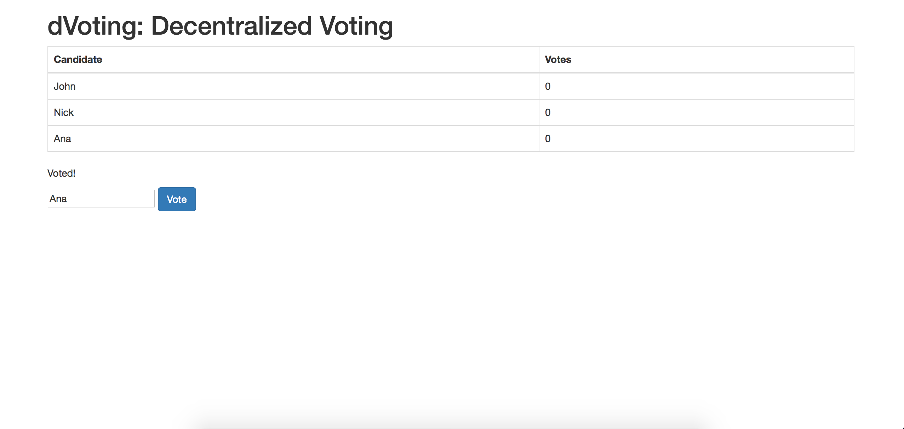

# dVoting

Decentralized voting application built on top of Ethereum.

# Dependecies

`
"dependencies": {
    "body-parser": "^1.18.2",
    "ejs": "^2.5.7",
    "ethereumjs-testrpc": "^4.1.3",
    "express": "^4.15.4",
    "solc": "^0.4.17",
    "web3": "^0.20.1"
  }
`